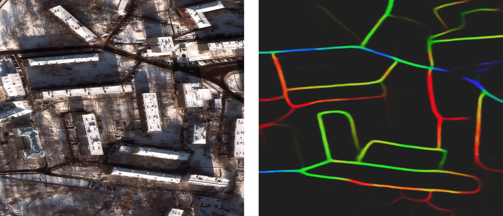

# Recent Research Projects

* [medium.com/@avanetten](https://medium.com/@avanetten)
* [github.com/avanetten](https://github.com/avanetten)
* [arXiv Papers](https://arxiv.org/search/?searchtype=author&query=Van+Etten%2C+A)

This site outlines recent research projects, which are primarily in the geospatial machine learning sphere as part of [CosmiQ Works](https://www.cosmiqworks.org).

-----
-----
## Machine Learning Utility Manifolds

Studying performance curves along various axes yields far more insights than just a single datapoint denoting maximum performance.  This concept has been an overaching theme for recent projects, summarized in [MACHINE LEARNING UTILITY MANIFOLDS FOR NOVEL DATASETS](https://www.cosmiqworks.org/wp-content/uploads/2020/08/iqt_labs_datasets_manifold_2020_08_v1.6_public.pdf).

 

_Notional utility manifold._

-----
-----
## Medium DownLinQ Blog

Much of research is available on [The DownLinQ](https://medium.com/the-downlinq) geospatial analysis blog, where as of March 2021 I've published [47 blogs](https://medium.com/@avanetten).

-----
-----
## Recent Academic Papers

_The Multi-Temporal Urban Development SpaceNet Dataset_, Van Etten, A. et al., [CVPR 2021](https://arxiv.org/abs/2102.04420)

_SpaceNet 6: Multi-Sensor All Weather Mapping Dataset_, Shermeyer, J. et al., [CVPR EarthVision 2020](https://openaccess.thecvf.com/content_CVPRW_2020/html/w11/Shermeyer_SpaceNet_6_Multi-Sensor_All_Weather_Mapping_Dataset_CVPRW_2020_paper.html)

_Road Network and Travel Time Extraction from Multiple Look Angles with SpaceNet Data_, Van Etten, A. et al.,  IEEE International Geoscience and Remote Sensing Symposium ([IGARSS 2020](https://ieeexplore.ieee.org/document/9324091))

_City-Scale Road Extraction from Satellite Imagery v2: Road Speeds and Travel Times_ Van Etten, A., [WACV 2020](https://openaccess.thecvf.com/content_WACV_2020/html/Van_Etten_City-Scale_Road_Extraction_from_Satellite_Imagery_v2_Road_Speeds_and_WACV_2020_paper.html)

_SpaceNet MVOI: A Multi-View Overhead Imagery Dataset_, Nicholas Weir, David Lindenbaum, Alexei Bastidas, Adam Van Etten, Sean McPherson, Jacob Shermeyer, Varun Kumar, Hanlin Tang, Proceedings of the IEEE/CVF International Conference on Computer Vision ([ICCV 2019](https://openaccess.thecvf.com/content_ICCV_2019/html/Weir_SpaceNet_MVOI_A_Multi-View_Overhead_Imagery_Dataset_ICCV_2019_paper.html))

_The Effects of Super-Resolution on Object Detection Performance in Satellite Imagery_,  Shermeyer, J., Van Etten, A.,  [CVPR EarthVision 2019](https://openaccess.thecvf.com/content_CVPRW_2019/html/EarthVision/Shermeyer_The_Effects_of_Super-Resolution_on_Object_Detection_Performance_in_Satellite_CVPRW_2019_paper.html)

_Satellite Imagery Multiscale Rapid Detection with Windowed Networks_, Van Etten, A.,  [WACV 2019](https://ieeexplore.ieee.org/document/8659155l}{WACV 2019)

_SpaceNet: A Remote Sensing Dataset and Challenge Series_, Van Etten, A., D. Lindenbaum, T. Bacastow, 2018, [arXiv](https://arxiv.org/abs/1807.01232) 

_You Only Look Twice: Rapid Multi-Scale Object Detection In Satellite Imagery_, Van Etten, A., 2018, [arXiv](https://arxiv.org/abs/1805.09512)

-----
-----
## Selected Projects

Below is are a few recent projects.  For a full list of projects, see  [github.com/avanetten](https://github.com/avanetten), or [recent papers](#Recent Academic Papers)

----
### YOLT / SIMRDWN

Five years ago (2016) no open source codebase existed for applying state of the art obect detection methods towards the enourmous sizes and unique challenges of satellite imagery.  Hence, [YOLT](https://github.com/avanetten/yolt) was created atop the YOLO framework, and proved able to locate vehicles, ships, buildings, and airports with high precision.  

Subsequently, [SIMRDWN]((https://github.com/avanetten/simrdwn) was created to extend the capabilities of YOLT to other object detection frameworks (YOLO, SSD, and Faster RCNN).  

_YOLT car predictions._

----
### CRESI

The [CRESI](https://github.com/avanetten/cresi) project provides an end-to-end pipeline to train models to detect routable road networks over entire cities, and also provide speed limits and travel time estimates for each roadway.  We have observed success with both SpaceNet imagery and labels, as well as Google satellite imagery with OSM labels. CRESI served as the baseline model for SpaceNet 3 and SpaceNet 5 (see below).

_Sample extracted road network and computed optimal path._

-----
### APLS

In order to ascertain the quality of proposal graphs created by CRESI, a new graph-theoretic metric was required since existing metrics either ignored important graph features or could not be adapted to new use cases.  APLS measures path lenth similarity for important segments, and was used to score both SpaceNets 3 and 5.  

_APLS path length differences._

-----
-----
## SpaceNet

As a founding member of [SpaceNet](https://spacenet.ai), I have been heavily involved in SpaceNets 1-7.  SpaceNet is consortium dedicated to providing high quality labeled satellite imagery to the community, and running public data science challenges with these novel datasets.  I served as Challenge Manager for SpaceNets 3, 5, and 7.  

-----
#### SpaceNet 3

SpaceNet 3 aimed to extract routable road networks directly from satellite imagery.  To evaluate proposals, the APLS metric was created (see below).  See the CosmiQ Works [project page](https://www.cosmiqworks.org/archived-projects/spacenet-3/), [SpaceNet page](https://spacenet.ai/spacenet-roads-dataset/), or the papers below for further details about SpaceNet 3.

_Predicted road network in Las Vegas._

-----
#### SpaceNet 5

SpaceNet 5 built upon SpaceNet 3, and strove to infer travel times as well as physical geometry for road networks.  aimed to extract routable road networks directly from satellite imagery.  See the CosmiQ Works [project page](https://www.cosmiqworks.org/archived-projects/spacenet-5/), [SpaceNet page](https://spacenet.ai/sn5-challenge/), or the papers below for further details about SpaceNet 5.

_Road predictions, colored by speed._ 

------
#### SpaceNet 7

SpaceNet 7 was the first SpaceNet challenge to focus on time series analysis, specifically urban development and building tracking.   See the CosmiQ Works [project page](https://www.cosmiqworks.org/archived-projects/spacenet-7/), [SpaceNet page](https://spacenet.ai/sn7-challenge/), or the papers below for further details about SpaceNet 7.

_Urban change captured in one of the SpaceNet 7 regions._ 

